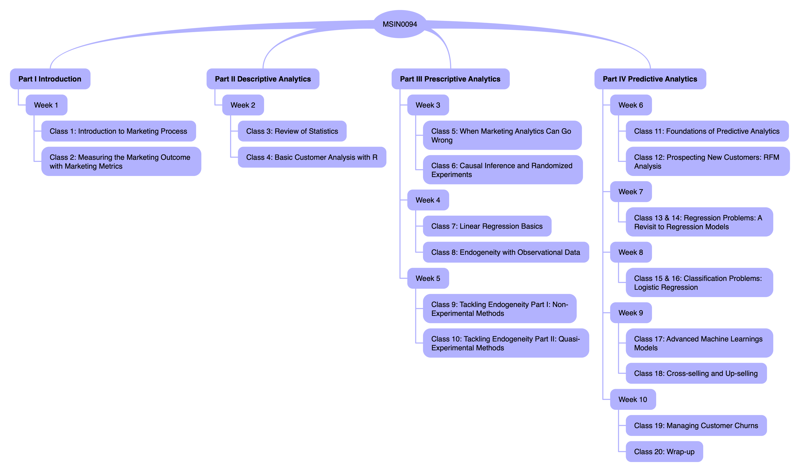

# Syllabus: MSIN0094 Marketing Analytics
(Last update on `r format(Sys.time(), '%d %B, %Y')`)

## Instructor Information

*Module Leader*: Dr. Wei Miao[^1] [(wei.miao\@ucl.ac.uk)](mailto:wei.miao@ucl.ac.uk)

[^1]: Wei is pronounced as "way", which stands for jade in Mandarin; Miao is my family name, which is exactly pronounced as "meow", the sound of a kitty.

*Office*: S3, Level 38, One Canada Square

*Office hour*: Details to be announced in Week 1

## Teaching Assistants

-   Christopher Ogbunuzor [(christopher.ogbunuzor.14\@ucl.ac.uk)](mailto:christopher.ogbunuzor.14@ucl.ac.uk)
-   Henry Bellhouse [(henry.bellhouse.18\@ucl.ac.uk)](mailto:henry.bellhouse.18@ucl.ac.uk)


## Course Objective

Marketing analytics addresses how to utilize analytics tools to better carry out marketing tactics and strategies. The digital age has fundamentally altered the way we collect, process, analyze, and disseminate data intelligence. Driven by advances in computing power, software, and other information technologies, the very nature of marketing analytics has evolved. In this module, students will learn the scientific approach to real-world marketing problems with hands-on use of a combination of econometrics, statistics, machine learning, and programming, to collect, analyze, and act on customer intelligence.

Throughout the module, student will learn how to guide a company's marketing decisions along three dimensions: descriptive analytics, prescriptive analytics, and predictive analytics. Specifically, descriptive analytics involves using visualization tools and statistical tests to provide model-free insights into the customer intelligence; prescriptive analytics focuses on drawing causal inference via experimental, quasi-experimental, and non-experimental methods; predictive analytics shed light on how to prospect new customers, up-sell and cross-sell high value products, and mitigate customer churns, using appropriate machine learning models. At the end of the module, students will have the full capacity to carry out independent marketing research for their dissertation projects as well as lead a marketing analytics team in their future jobs.


## Module Structure Overview

```{r, echo=FALSE, fig.align='center'}

```

## Office Hours

It is a good practice to utilize the Moodle forum as an interactive place to promote peer-to-peer learning. For any question, please first check the Moodle forum and see if the questions are already posted and answered by any of your fellow classmate there. If not, please post your questions in the Moodle forum. For any forum questions, we will first leave for your fellow classmates to provide potential answers. The teaching team will also monitor the forum and clarify any unanswered questions.

If your question is still unsolved, please make appointments for office hours. I am available to answer any questions you may have about past lectures, case studies, and any other queries related to marketing analytics during my office hours. I will confirm the detailed time slots and the link in the first class.

Please make sure of the following before/when you make your appointment:

-   Please be careful when operating on the Excel form and kindly avoid overwriting/modifying other students' appointments.

-   Please use the "comment" function in Excel form to briefly describe the questions you have so that other students sharing similar questions can drop in as well.

-   Each session lasts for 15 minutes. If you expect your questions may take a longer time to solve, you can book two consecutive sessions. Each student is entitled to at most two sessions per week to ensure equal opportunities for all students.


## Programming Language

We will use an open-source programming language R throughout the course. R is one of the most commonly used programming languages by data scientists, economists, and statisticians, and is sometimes called the "golden child" of data science. R is cross-platform compatible; with over 16,000 packages ready for use in CRAN (R's open-source repository), it has one of the richest ecosystems to perform data analytics tasks. More importantly, it's free of charge compared with other commercial software (it is good to have cost-effectiveness in mind as you are now business school students)!

In this module, I will cover the basics of R and then focus on how to perform data-cleaning tasks efficiently with R. If you have little prior exposure to R, **it is highly recommended that you start learning some R basics before Week 2 to avoid falling behind**. UCL library has rich digital resources of R textbooks, which can be downloaded free of charge using your UCL credentials.

During (and even after) this module, whenever your run into any problems with R, Google (especially Stack Overflow) is always your best place to seek answers for most debugging issues; if you have any specific tasks in mind, the [R Task Views page](https://cran.r-project.org/web/views/) provides comprehensive guidance of which packages on CRAN are relevant for tasks related to a certain topic.


## Classroom Etiquette

-   **Punctuality**. Classes will start on time. Please be on time.

-   **Class participation**. Please keep your mobile phones and laptops muted at all times unless otherwise instructed.


## Assignments and Grading policy

Much of the learning during the course will happen with the help of individual assignments. Each assignment is carefully designed to examine the learning outcome of the topics taught during the previous weeks. Your final grade in this module will be based on 3 individual assignments with their associated weights as follows:

-   1st assignment, 30% weight, 1500 words, due on Oct 12
-   2nd assignment, 40% weight, 2000 words, due on Oct 26
-   3rd assignment, 30% weight, 1500 words, due on Nov 16

Detailed assignment descriptions will be given in due course.

### Code of Conduct and Plagiarism

As all assignments in this module are **individual** assignments, you should **NOT** work with other students and the write-up should reflect your own work only. Please refrain from consulting classmates, friends, or seniors who have taken the course already. In the context of this module, it is acceptable to refer to concepts, frameworks, and analytical tools from the readings or class lectures with appropriate citation. 

However, do not directly copy or paraphrase anything from other sources outside our classroom and present it as your own. It will be a violation of academic integrity if you base your assignments on solutions which you have found on the Internet or which you have obtained from others. You may risk failing this module if such a violation is found and investigated by the University. For detecting plagiarism, the School uses Turnitin. Turnitin checks your submission against 24+ billion web pages, 300+ million student papers, and 110,000+ publications and provides a similarity index. A particularly high similarity index will draw attention to the submission.

### Word count
Please note, according to UCL's policy, you should **follow the word limit**. Otherwise, your mark may be reduced. Therefore, try to keep your answer concise and to the point. 

### Marks and Feedback

Your marks and feedback for each assignment will be usually released no later than 4 weeks after the submission date. Each assignment will be carefully marked according to the mark scheme by our teaching assistants, and there will be adequate second-marking procedures in the marking process to ensure the marking quality, as required by UCL. As a result, it is the university policy that students shouldn't question the academic judgement of markers, and **please refrain from emailing teaching assistants for any re-marking**.


## How to Make the Best Use of Case Studies

To develop and test your skills in solving real-life marketing analytics problems, we will use many relevant case studies along the learning journey. Most case situations have been developed after careful research on actual situations faced by real companies and managers. The case authors have attempted to describe enough of the background and details of the situation in order to provide an adequate basis for class discussion.

Merely reading the case is not enough. To maximize the learning outcome, please follow the following advice for case preparations:

-   After an initial reading to get a broad overview, go back and study the case thoroughly.

-   Make notes wherever necessary and mark up the case, especially key information such as important numbers, to facilitate your understanding of the case background.

-   Carefully think about the key problems. Always try to come up with alternative solutions to the problem and think about the pros and cons of each.


## Copyright Issues

All of the materials in this module are copyrighted, either purchased by UCL, written by me, or owned by other people. Please refrain from uploading any materials in the module to other external websites or sharing any materials in the module with anyone who is not attending this class. A copyright violation may be investigated by the school.


