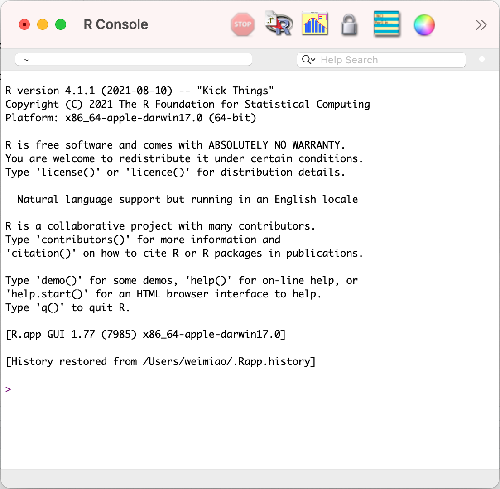

```{r setup, include=FALSE}
knitr::opts_chunk$set(echo = TRUE, include = TRUE)
```

# Install and Setup R

## Class Objective

Learning objective:

-   Understand R's history and main functionality

-   Be able to setup R and Rstudio

-   Understand how to use install and load packages in R

-   Understand the key concepts of R

## What is R

-   R is both a programming language and software environment for statistical computing, which is free and open-source (<https://www.r-project.org/about.html>).

-   The ***R Project*** was initiated by Robert Gentleman and Ross Ihaka (University of Auckland) in the early 1990s as a different implementation of the S language, which was developed at Bell Laboratories.

-   Since 1997, R has been developed by the ***R Development Core Team***.

-   Refer to the [Wiki](https://en.wikipedia.org/wiki/R_(programming_language)) page for a full history of R development.

## What is R used for?

R can do almost anything you can think of! Below is a (incomplete) list of what I normally use R for on a daily basis.

-   Data analytics (statistics, data manipulation, machine learning, econometric analysis, etc.)

-   Building your own homepage. I build and maintain my [personal website](http://miaowei.netlify.app) with the `blogdown` package completely in R

-   Prepare your presentations using R `markdown`

-   Write books (such as this whole online supplement) using R `bookdown`

You can even scrawl webpages and send emails with R once you install the right packages.

## Popularity of R

R has been one of the most popular programming language used by statisticians, economists, and data analysts.

Below is the popularity index of different languages by [tiobe.com](https://www.tiobe.com). R reached its historic highest in August 2020, ranking the 8th among all.

```{r, echo=FALSE, fig.align='center'}

```

## Install and Setup R on your computers: Step 1

There are alternative ways to install and use R on your computers. Below is the most recommended and hassle free way to install and setup R on your computer.

**Step 1**: Download R from the official website [CRAN](https://www.r-project.org).

**Tips**:\
- Note that R version is updated on a regular basis, to fix bugs or add new features. It's good to keep your R up to date with the official website.\
- However, sometimes across major versions, some R's base functions may be depreciated and cause breaks in your code, so it's important to read the R News after each update, so that you understand what's been updated in the latest version and if there will be any breaks in your previous code. (For a deeper understanding of this issue, please refer to this [article](http://datacolada.org/95) regarding reproducible research with R.)

## Screenshot of R Console

R's default user interface:

```{r, echo=FALSE, fig.align='center'}

```

## Install and Setup R on your computers: Step 2

After step 1, you can already open R's own GUI and run R codes. However, we still need an [integrated development environment](https://en.wikipedia.org/wiki/Integrated_development_environment) (IDE) to help us better write R codes. Rstudio is currently the best IDE for R.

**Step 2**: Download and install Rstudio from [Rstudio's website](https://www.rstudio.com/products/rstudio/download/).

For a introduction to the Rstudio IDE, refer to this [cheat sheet](https://github.com/rstudio/cheatsheets/raw/master/rstudio-ide.pdf).

## Screenshot of RStudio

Our preferred R editor: Rstudio

```{r, echo=FALSE, fig.align='center'}
knitr::include_graphics("images/r_Rstudio.png")
```

## Glossary

-   ***script***: (top left) where you write codes a text-readable file (E.g., 'test.R', 'test.Rmd', etc.), each separated by a new line.

-   ***console***: (bottom left) where you can type commands interactively with R and get the results immediately

-   ***environment***: (top right) a list of named variables/objects that we have generated; can be checked on the 'environment' panel.

-   ***history***: (top right) the list of past commands thaty we have used

-   ***help***: (bottom right) a documentation of all the functions available in R (the user manual)

-   ***package***: (bottom right) a collection of additional functions and dataset

## Use Help

Whenever you don't know how to use a function, you can either

-   use `help`. Enter the command `help(log)` in R console

```{r help, include=T, echo=T}
?log
help(log)
```

-   or you can directly search for the function in RStudio help panel.

If you cannot get an answer:

-   (1st) Google your error message or search/ask for help in Stack Overflow

-   (2nd) Ask in Moodle Forum

-   (3rd) Use office hours

## Libraries and packages management: the coventional way

To achieve certain tasks, for instance, to run a regression analysis, we can definitely write our own code from scratch. However, it may take much time if we would like to build everything from zero. That's when the packages/libraries can help us to improve our efficiency by a large margin.

One of the best things about R is that it has tens of thousands of extremely useful packages/libraries. And some are even exclusive to R, for instance, the `grf` package that runs the causal forest model, which I have used for my research.

```{r, include=T, echo=T}
# install.packages('data.table') # install the package
library('data.table') # load the package
```

## Libraries and packages management: the simplest way

In R, there is a package called `pacman`, which stands for package management and is probably the most convenient way to manage R packages.

**Task:** Load `ggplot2` and `data.table` packages; if they are not installed, install them and then load them.

```{r, include=T, echo=T}
# install.packages('pacman')

pacman::p_load(data.table,ggplot2)

```

## Comment your codes

You can put a "\#" before any line of code, to indicate that this line is your comment, and this line will turn green and not run by R.

```{r, include=T, echo=T}
# print("David is handsome")

```

# R Basics

## Use R as a calculator

We can do the basic mathematical calculation in R as follows:

```{r calculator1, include=T, echo=T}
8+8
8-8
8*8
2/2
```

Common mathematical operations/functions can also be used in R.

```{r calculator2, include=T, echo=T}
log(1)
exp(1)
log(exp(1))
sqrt(25)
```

## Assign value

In R, we normally use the left arrow to assign a value to an object `<-`

```{r assign, include=T, echo=T}
x <- log(2)
x
```

You can also use equal sign `=` without issues, but it's recommended to stick with R's tradition.

## Data types

-   Numeric/Double (e.g. 2.5, 1/5, 1.0, etc.)

-   Integer (e.g. 1, 2, 3, etc.)

-   Complex (e.g. 1 + 2i, etc.)

-   Logical (e.g. TRUE, FALSE or NA)

-   Character (e.g. "Wei", "UCL", "1 + 1 = 3", "TRUE", etc.)

-   Factor/Categorical ("male", "female", etc.)

```{r, include=T, echo=T}
# Character Vector
str1 <- c("R","Python","Java","Scala","Julia")

# Numeric Vector 
num2 <- c(1, 2, 3.4, 5, 5.9)

# Integer Vector  
int3 <- (1:10) 

# Logical Vector 
log4 <- c(TRUE, FALSE, FALSE, T, F) 

# 5. Complex
com5 <- c(2+3i, 3+5i, 4+5i)

```

-   Special type: `NA` which stands for missing values; this is a very tricky type that needs additional attention, as we will show below.

```{r, include=T, echo=T}

missing <- c(1,NA,2,NA)

mean(missing)

mean(missing,na.rm = T) ##### important!!!, do not forget na.rm = T

# check missing values
is.na(missing)

anyNA(missing)

sum(is.na(missing))

```

## Data type: other special values

-   `Inf` is infinity. You can have either positive or negative infinity.

-   `NaN` means "Not a Number". It's an undefined value.

```{r, include=T, echo=T}
a <- 1/0 #Inf
a

is.infinite(a)
is.na(a)
```

```{r, include=T, echo=T}
b <- 0/0 #NaN
b
is.nan(b)
is.na(b)
```

## Data type: check data type using class()

We can use `class()` to check the type of an object in R.

```{r, include=T, echo=T}

a <- '1+1'
class(a)

b <- 1+1
class(b)

```

## Data type: conversion

```{r}
a <- '1'
class(a)
b <- as.numeric(a)
class(b)
```

## Data structures


## Vectors: creating vectors

### Creating vectors: c()

Vector can be created using the command `c()`.

```{r vectors_base, include=T, echo=T}
x <- c(1, 3, 5, 10)
x
class(x)
```

Vectors must contain elements of the same data type. Otherwise, it will convert elements into the same type.

```{r vectors_type, include=T, echo=T}
x <- c(1, "intro", TRUE)

class(x)
```

### Creating vectors: length()

You can measure the length of a **vector** using the command `length()`

```{r vectors_length, include=T, echo=T}
x <- c('R',' is', ' fun')
length(x)

y <- c(NULL)
length(y)
```

### Creating vectors: seq() and rep()

It is also possible to easily create sequences

```{r vectors_sequences, include=T, echo=T}
# use colon ':'
1:10
# use seq()
seq(from = 1, to = 2, by = 0.1)
# for date object
seq.Date(from = as.Date("2021-09-27"), 
         to = as.Date("2021-10-01"), 
         by = '1 days')
# replication using rep()
rep("A", times = 5)
```

To understand all usages of a function, use `help()`

### Creating vectors: combine vectors

You can use `c()` to combine different vectors; this is very commonly used when concatenating vectors.

```{r vectors_multiple, include=T, echo=T}
x <- 1:3 # from 1 to 3
y <- c(10, 15) # 10 and 15
z <- c(x,y) # x first and then y 
z
```

## Vectors: subsetting

We put the index of elements we would like to extract in a **square bracket**. Different languages use different ways to index and subset vectors and matrices.\
- For instance, Matlab uses parentheses for subsetting vectors and matrices.

```{r vectors_subset, include=T, echo=T}
x <- c(1,3,8,7) 
x[2] # which element is in the second position?
x[1:2] # which elements are in the first 2 positions?
x[c(1,3,4)] # which elements are in positions 1, 3 and 4?
```

## Vectors: relational operation

```{r vectors_subset2, include=T, echo=T}
x <- c(1,3,8,7) 
x < 6 # is each element lower than 6?
x == 10 # is the element equal to 10?
which(x == 8) # which element equals 8 
max(x) # what is the max element
which.max(x) # which is the max element 

x[(which.min(x))] #  = min(x)

## logical operation
T & F # and

T | F # or

!T # not
```

A special relational operation is `%in%` in R, which tests whether an element exists in the object.

```{r}
3 %in% x

4 %in% x

3 %in% x & 4 %in% x
```

## Vectors: elementwise operations

Similar to other matrix languages (Matlab), R is a vectorized language, meaning by default it will do vector operation internally.

```{r vectors_operations, include=T, echo=T}
x <- c(1,3,8,7)
x+2
x-2
x*2
x^2
```

### Caveat with vector elementwise operation

***Caveat*** When the length of vectors do not match, R will still do it for your without reporting error but a warning message. As you can see, even if the length of vectors does not match, R can still return an output.

It's important to check the warning messages when there is any!!

```{r Caveat, include=T, echo=T}
x <- c(1,3,8,7)

y <- c(1,3,4) # careful!!! does not report error
x + y

z <- c(10,12,13,14)
x + z
```

## Matrices: creating matrices

### Creating matrices: matrix()

A matrix can be created using the command `matrix()`\
- the first argument is the vector to be converted into matrix\
- the second argument is the number of rows\
- the last argument is the number of cols (optional)

```{r matrix, include=T, echo=T}
matrix(1:9, nrow = 3, ncol = 3)

matrix(1:9, nrow = 3, ncol = 3)

matrix(1:9, nrow = 3, ncol = 2)

```

Note: R automatically inserts elements by columns

### Creating matrices: inserting by row

However, we can ask R to insert by rows by setting the 'byrow' argument.

```{r matrix_byrow, include=T, echo=T}
matrix(1:9, nrow = 3, ncol = 3, byrow = TRUE)
```

### Creating matrices: concatenation of matrices cbind() and rbind()

We can use `cbind()` and `rbind()` to concatenate vectors and matrices into new matrices.

```{r matrix_fromvectors, include=T, echo=T}
x <- cbind(1:3, 4:6) # column bind
x
y <- rbind(7:9, 10:12) # row bind
y

cbind(x,x)
```

## Matrices: indexing and subsetting

```{r matrix_subset, include=T, echo=T}
x
x[1,2] # the element in the 1st row, 2nd column
x[1,] # all elements in the first row
x[,2] # all elements in the second columns
x[c(1,2),]
```

## Matrices: operations

Let's use 3 matrices `x`, `y`, and `z`:

```{r matrix_operations1, include=T, echo=T}
x
y
z <- x^2
z
```

### Matrices' operations: matrix addition and multiplication

```{r matrix_operations2, include=T, echo=T}
x+z   # elementwise addition
x*z   # elementwise multiplication
x%*%y # matrix multiplication
```

### Matrices' operations: inverse and transpose

```{r matrix_operations3, include=T, echo=T}

t(x) # transpose

t(x)%*%x

solve(t(x)%*%x) # inverse; must be on a square matrix

```

## Arrays

```{r arrays, include=T, echo=T}
x <- 1:4
x <- array(data = x, dim = c(2,3,2))
x
```

-   Just like vectors and matrices, arrays can include only data types of the same kind.

-   A 3D array is basically a combination of matrices each laid on top of other

## Lists

A list is an R object that can contain anything.

```{r list, include=T, echo=T}
x <- 1:2
y <- c("a", "b")
L <- list( numbers = x, letters = y)
```

## Lists: indexing and subsetting

There are many ways to extract a certain element from a list.\
- by index\
- by the name of the element\
- by dollar sign `$`

```{r list_subsetting, include=T, echo=T}
L[[1]] # extract the first element
L[['numbers']] # based on element name
L$numbers # extract the element called numbers
```

After extracting the element, we can work on the element further:

```{r list_subsetting2, include=T, echo=T}
L$numbers[1:3] > 2
```

## Data Frames: creating dataframe

### Data Frames: create dataframe using data.frame()

Data Frame is the R object that we will deal with most of the time in the MSc program. You can think of `data.frame` as a spreadsheet in excel.

```{r dataframe, include=T, echo=T}
df <-  data.frame(id = 1:4,
  name = c("David", "Yongdong", "Anil", "Wei"),
  wage = rnorm(n=4, mean = 10^5, sd = 10^3), 
  male = c(T, T, T, T)
  )
df
```

### Data Frames: create dataframe using read.csv()

```{r, include=T, echo=T}
#read.csv('data.csv')
```

### Use R's own dataset

```{r, include=T, echo=T}
data("mtcars")
```

## Data Frames: property

Each row stands for an observation; each column stands for a variable.

Each column should have a **unique** name.

Each column must contain the same data type, but the different columns can store different data types.\
- dataframe is a special type of matrix, but allows different types across columns.

Each column must be of same length, because rows have the same length across variables.

You can verify the size of the `data.frame` using the command `dim()`; or `nrow()` and `ncol()`

```{r, include=T, echo=T}
dim(df)
nrow(df)
ncol(df)
```

You can get the `data type` info using the command `str()`

```{r, include=T, echo=T}
class(df)
str(df)
lapply(df, class)
```

## Data Frames: inspection

```{r dataframe_subset2, include=T, echo=T}
head(df, n=3) # first n observations
tail(df, n=3) # last n observations
names(df)
summary(df)
str(df)
```

## Data Frames: subsetting

Since a dataframe is essentially a matrix, all the subsetting syntax with matrices can be applied here.

```{r dataframe_subset, include=T, echo=T}
df$name # subset a column
df[,c(2,3)] # can also subset like a matrix
```

We are interesting in the cylinders and the weights of inefficient cars (lower than 15 miles per gallon).

```{r dataframe_subset_mtcars, include=T, echo=T}
poll_cars <- mtcars[mtcars$mpg<15, c("cyl", "wt")] # remember to assign the generated dataframe to a new name
poll_cars
```

# Programming Basics

## Variables

In programming, a variable denotes an object, i.e., a variable is a name that refers to an object in the memory. Variables in R programming can be used to store any R object discussed previously, including numbers, characters, matrices, and data frames.

R is a \***dynamically programmed language**, which means that unlike other programming languages (such as C++, which is a pain to debug), we do not have to declare the data type of a variable before we can use it in our program.

For a variable to be valid, it should follow these rules

-   It should contain letters, numbers, and only dot or underscore characters.
-   It should not start with a number (eg:- 2iota)
-   It should not start with a dot followed by a number (eg:- .2iota)
-   It should not start with an underscore (eg:- \_iota)
-   It should not be a reserved keyword.

## if/else

Sometimes, you want to run your code based on different conditions. For instance, if the observation is a missing value, then use the population average to impute the missing value. This is where `if/else` kicks in.

    if (condition == TRUE) {
      action 1
    } else if (condition == TRUE ){
      action 2
    } else {
      action 3
    }

Example 1:

```{r controlflow, include=T, echo=T}

a <- 15

if (a > 10) {
larger_than_10 <- TRUE  
} else {
  larger_than_10 <- FALSE
}

larger_than_10  
```

Example 2:

```{r, include=T, echo=T}
x <- -5
if(x > 0){
  print("x is a non-negative number")
} else {
  print("x is a negative number")
}
```

## Loops

As the name suggests, in a loop the program repeats a set of instructions many times, until the stopping criteria is met.

Loop is very useful for repetitive jobs.

```{r loops, include=T, echo=T}
for (i in 1:10){ # i is the iterator
  # loop body: gets executed each time
  # the value of i changes with each iteration
}
```

## Nested loops

We can also nest loops into other loops.

```{r loops3, include=T, echo=T}
x <- cbind(1:3, 4:6) # column bind
x
y <- cbind(7:9, 10:12) # row bind
y

z <- x

for (i in 1:nrow(x)) {
  for (j in 1:ncol(x)){
    z[i,j] <- x[i,j] + y[i,j]
  }
}

z
```

## Functions

A function takes the argument as input, run some specified actions, and then return the result to us.

Functions are very useful. When we would like to test different ideas, we can combine functions with loops: We can write a function which takes different parameters as input, and we can use a loop to go through all the possible combinations of parameters.

### User-defined function syntax

Here is how to define a function in general:

```{r functions, include=T, echo=T}
function_name <- function(arg1 ,arg2 = default_value){
  # write the actions to be done with arg1 and arg2
  # you can have any number of arguments, with or without defaults
  return() # the last line is to return some value 
}
```

Example:

```{r functions2, include=T, echo=T}
magic <- function( x, y){
  return(x^2 + y)
}

magic(1,3)

```

## A comprehensive example

Task: write a function, which takes a vector as input, and returns the max value of the vector

```{r, include=T, echo=T}

get_max <- function(input){
  max_value <- input[1]
  for (i in 2:length(input) ) {
    if (input[i] > max_value) {
      max <- input[i]
    }
  }
  
  return(max)
}

get_max(c(-1,3,2))

```

Exercise:

Write your own version of `which.max()` function
